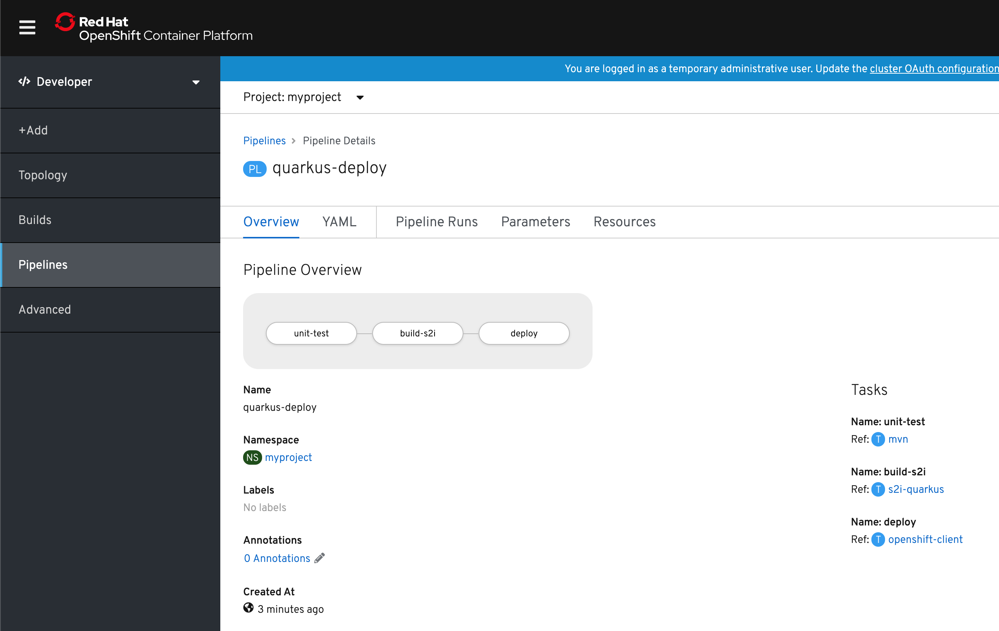
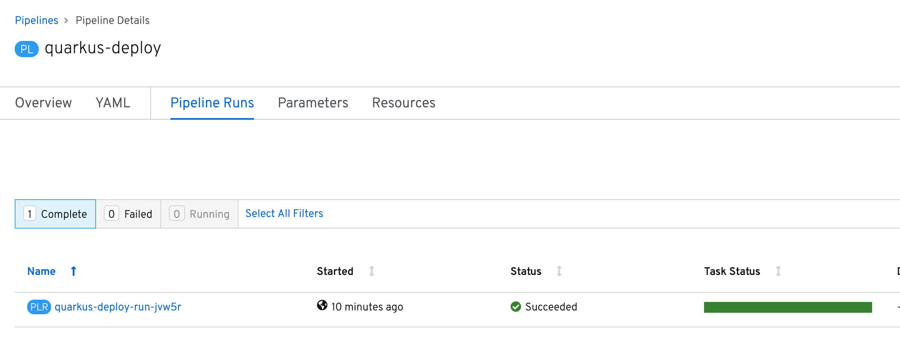

= Pipeline Setup
== Project Requirements

[source,bash]
----
oc new-project myproject && \
oc adm policy add-scc-to-user privileged -z pipeline && \
oc adm policy add-role-to-user edit -z pipeline && \
oc adm policy add-scc-to-user privileged -z default && \
oc adm policy add-scc-to-user anyuid -z default
----

== Tasks

Create the following Tekton tasks which will be used in the `Pipelines`

[source,bash]
----
oc apply -f https://raw.githubusercontent.com/tektoncd/catalog/master/openshift-client/openshift-client-task.yaml \
  -f https://raw.githubusercontent.com/openlab-red/pipelines-catalog/master/quarkus/s2i-quarkus-task.yaml \
  -f https://raw.githubusercontent.com/openlab-red/pipelines-catalog/master/quarkus/quarkus-native-task.yaml \
  -f https://raw.githubusercontent.com/openlab-red/pipelines-catalog/master/quarkus/quarkus-jvm-task.yaml \
  -f https://raw.githubusercontent.com/openlab-red/pipelines-catalog/master/maven/mvn.yaml
----

Check the tasks created

[source,bash]
----
tkn task ls
----

```
NAME                AGE
kn-create-service   12 seconds ago
openshift-client    13 seconds ago
quarkus-jvm         12 seconds ago
quarkus-native      12 seconds ago
s2i-quarkus         13 seconds ago
```


== Prepare the Resource

[source,bash]
----
oc create -f pipeline/resources.yaml
----
Check the resource created

[source,bash]
----
oc get is,sc,dc,route, pipelineresource
----

```
NAME                                     IMAGE REPOSITORY                                                     TAGS   UPDATED
imagestream.image.openshift.io/quarkus   image-registry.openshift-image-registry.svc:5000/myproject/quarkus

NAME                                             PROVISIONER            AGE
storageclass.storage.k8s.io/standard (default)   kubernetes.io/gce-pd   24d

NAME                                         REVISION   DESIRED   CURRENT   TRIGGERED BY
deploymentconfig.apps.openshift.io/quarkus   0          1         0         config

NAME                               HOST/PORT                                PATH   SERVICES   PORT   TERMINATION   WILDCARD
route.route.openshift.io/quarkus   quarkus-myproject.apps.pro.openlab.red          quarkus    http                 None

NAME                                                 AGE
pipelineresource.tekton.dev/openlab-red              63s
pipelineresource.tekton.dev/quarkus-internal-image   63s
```

== Deploy the pipeline

[source,bash]
----
oc create -f pipeline/deploy.yaml
----
Check the pipeline created

[source,bash]
----
oc get pipeline
----

```
NAME             AGE
quarkus-deploy   41s
```

From Developer Console > Pipelines



== Launch the pipeline

[source,bash]
----
tkn pipeline start quarkus-deploy -s pipeline
----


=== With nexus

[source,bash]
----
tkn pipeline start quarkus-deploy -p "MAVEN_MIRROR_URL=http://nexus3.labs:8081/nexus/content/groups/public" -s pipeline
----

```
? Choose the git resource to use for app-git: openlab-red (https://github.com/openlab-red/quarkus-workshop-labs#kafka)
? Choose the image resource to use for app-image: quarkus-internal-image (image-registry.openshift-image-registry.svc:5000/myproject/quarkus:latest)
? Value of param `APP_NAME` ? (Default is quarkus) quarkus
Pipelinerun started: quarkus-deploy-run-mww4f
Showing logs...
```

== Green



== Verify

[source,bash]
----
oc get pod -lapp=quarkus
----
